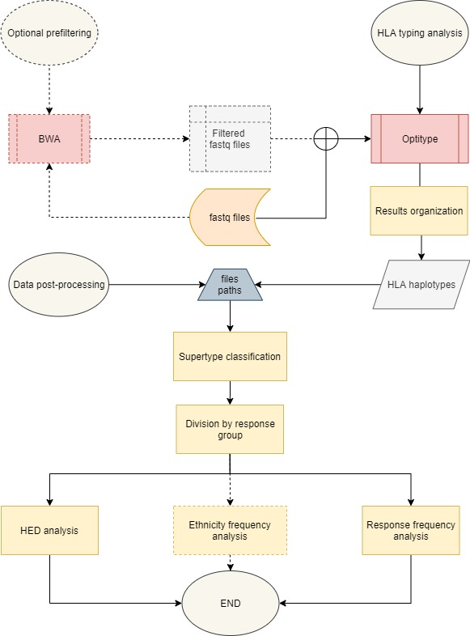

# HLA-typing
## Introduction
This repository provides an automatized workflow which infers the HLA haplotypes from RNA-seq data and proproduces a series of observations in the form of graphic viualizations and text format otuputs.

## Requirements

- Optitype (via docker)
- Samtools (for prefiltering step only)
- BWA (for prefiltering step only)
- Python 3.7.6
- R 3.6.3

Python modules:
- Pandas 1.0.1
- Matplotlib 3.1.0

R modules:
- Circlize 0.4.10
- ComplexHeatmap 2.5.4
- FactoMineR 2.3
- Factoextra 1.0.7
- ggplot2 3.3.2
- ggpubr 0.4.0

----------------------------------------------
## Flowchart 
- Dashed boxes stand for processes that are not included in the main analysis. However the scripts for such analysis are available in the repository.
- Red boxes represent the external softwares used for the analysis. 
- Yellow boxes represent the main processes of the analysis.
- Blue boxes represent databases that have been used to enrich the analysis.
- Orange boxes are the files produced by external data processing.
- Grey boxes represent the output of the analysis.



## Usage
All the scripts must be launched from the HLA-typing directory. 

### Primary analysis 

The primary analysis consists of the HLA-typing by Optitype from paired fastq samples. The the results are resumed in a single file (*hla.tsv*), which is later used for post processing.
Optitype is lounched virtually through docker, make sure it is globally available (documentation https://github.com/FRED-2/OptiType).

The absolute path of the files to be analyzed must be specified, the results are written in a subdirectory of that indicated for the input which name must be specified.
To run the analysis:
```bash
bash primary_analysis.sh -i /path/to/input/files -o output/
```
#### Prefiltering step

Due to memory issues, optitype may require a prefiltering step to be able to operate the alignment. The documentation about this process is available at the optitype repository.

In this repository a script is provided to operate this step throught BWA. The reference sequence to be used for this step is available at the optitype repository and must be indexed with BWA, which path (-a) must be specified when launching the script together with the output (-o) and the input (-i) directory, as it follows:
```bash
bash optitype_prefiltering.sh -a /path/to/bwa/indexed/reference/genome  -i /path/to/input/fastq/files -o /path/to/output/filtered_samples/
```
------------------------------------
### Secondary analysis

The secondary analysis consists of a post processing of the files produced with the primary analysis.
To run the analysis one must indicate the input info file (-i) and the input haplotype table file (-f) that must be in the same format as *test/hla.tsv*. The output will be generated by default in the /output directory of the repository, but a different one can be specified (the new directory will be created if it does not exist). An optional -e argument can be specified to run an additional ethnicity analysis while -h will print usage.
```bash
bash secondary_analysis.sh -i /abs/path/to/info_file -f /abs/path/hla_haplotype -o /abs/path/to/output [-e] [-h]
```
This analysis relies on an additional file which must be maually filled in by the user. The structure is given: 

| sample  |group   |  ethnicity |
| ------------ | ------------ | ------------ |
| Sample_1  | NR/R/NA | arab/asian/austronasian/black/caucasian/global  |

> Group: NR (non responder), R (responder), NA (unknown). If NA is used that sample is not included in the analysis.

> Ethnicity: asian, austronasian, arab, black, caucasian or global (global is to be used if ethnicity is not known or if it is different from the ones listed before). 

> Sample ID: can have any format but it will be substituted to produce better visualizations (substitution info table will be produced as output).

Other external files used by the pipeline:

- **distance.tsv**
Grantham distance matrix is provided to calculate the distance between the two aminoacids (https://pubmed.ncbi.nlm.nih.gov/4843792/).

- **sequence.fa**
Aminoacid sequences for all annotated alleles of genes A, B and C of the HLA locus (ftp://ftp.ebi.ac.uk/pub/databases/ipd/imgt/hla/alignments/). This sequences will be used together with Grantham's distance matrix for the calulation of the distance between the two alleles co-occuring in an individual.

- **supertypes.xls**
This tsv file is used to convert HLA alleles into more general supertypes according to their antigen binding ability. This classification is used to simplify the dimentionality of the analysis. The original file can be found at the following link: https://bmcimmunol.biomedcentral.com/articles/10.1186/1471-2172-9-1 .

#### Results
The produced results are listed below:
1. **TSV** 
	- **hlaST** - present the same structure and content of the file "hla.tsv" but reports supertype associated to alleles. Unknown supertypes are omitted.
	- **ids** - info file on sample ids substitution.
	- **ethnicity_freq** - The relative frequency of occurence of any allele predicted from the primary analysis is calculated and added to the table accordingly with the ethnicity that the individual is labeled with. If it is not known the "global" must be assigned.
	- **resp_a_freq** - The relative frequency of occurence of any allele predicted from the primary analysis is calculated and added to the table accordingly to the response group that the individual is labeled with.
	- **resp_st_freq** - Same information given by resp_a_freq.tsv but based on supertypes rather than single alleles. Gene C is not included in this classification.
	- **homo_freq** - The frequency of homozygosity for each gene (A, B and C) is calculated globally and for the two response groups.
	- **A/B/C_homoCounts** - Counts of homozigous vs. heterozigous patients for genes A, B and C. 
	- **HED** - Each individual is assigned with the distance between his couple of alleles for gene A, B and C separately and with a mean distance value between these three.
	- **HED_cat** - Each individual is assigned with a categorical value "high" or "low" based on the mean distance for each gene A, B and C separately.
	- **count_a**, **count_st** - counts of individuals that present specidic alleles and supertypes (homozygosity counts once).
	
2. **PNG**
	- **diff_a_boxplot** - Boxplot of allele frequency distance distribution.
	- **diff_st_boxplot** -  Boxplot of supertype frequency distance distribution.
	- **homoGene_barplot** - Comparison between homozygosity frequency in R vs. NR for genes A, B and C.
	- **homoAllele_barplot** - Comparison between normalized counts of homozygosity for specific alleles.
	- **groups** - individuals are grouped based on the response group they are labeled with.
	- **biplot** - individuals are clustered depending on their response group and related variables are shown.
	- **contibution** . percentage of variance explained.
	- **variables** - categorical variables are plotted accordingly to their similarity and are filtered and coloured according to their cos2.
	- **HED_heatmap** - A heatmap which represents the distance between alleles in all patients. An additional annotation boxplot informs on the variability of distances for the three genes while another specify to which group the patient belongs. Patient clustering is provided.
	- **ethn_freq_heatmap** - A heatmap that highlights defferences in the allele frequency among different ethnic groups. 
	- **response_freq_heatmap** - graphic representation of allele frequency for the two response groups with an annotation of distance in allele frequency between the two groups.
	- **responseST_freq_heatmap** - graphic representation of allele frequency for the two response groups based on supertypes rather than single alleles.
	- **A/B/C_circleplot**, **A/B/C_ST_circleplot** - graphic representation of alleles co-occurence in responders vs. non-responders for the three genes.
	- **diff_a_boxplot**, **diff_st_boxplot** - plot of frequency distance distribution for alleles (a) and supetypes (st).
	- **homoAlleles_barplot** - stacked barplot for normalized counts of the incidence of a single allele in the homozygosity event for group R and NR.
	- **homoGenes_barplot** - homozygosity event frequency for genes A, B and C in group N and NR.
	
3. **TXT**
	- **HED_wilcox** - Wilcox test resuts on genes A, B and C.
	- **HED_MCA** - in this file all the quantitative info reguarding the MCA anlysis are reported.
	- **homo_fisher** - Checking categorical indipendence between homozygosity and response to treatments. Results are reported for single genes.
	- **freq_fisher** - Checking categorical indipendence between frequencies and response to treatments. Results are reported for single alleles and supertypes based on presence vs absence of those.
	
--------------------------------------------
## Test
Primary analysis:

```bash
bash primary_analysis.sh -i /abs/path/to/test -o out_test
```
Secondary analysis:
```bash
bash secondary_analysis.sh -i /abs/path/to/test/info.tsv -f /abs/path/to/test/hla.tsv -o output/test
```
-------------------------------------------
## References

Szolek, A., Schubert, B., Mohr, C., Sturm, M., Feldhahn, M., & Kohlbacher, O. (2014). OptiType: precision HLA typing from next-generation sequencing data. Bioinformatics (Oxford, England), 30(23), 3310–3316. https://doi.org/10.1093/bioinformatics/btu548

Li H. and Durbin R. (2009) Fast and accurate short read alignment with Burrows-Wheeler Transform. Bioinformatics, 25:1754-60. [PMID: 19451168]
